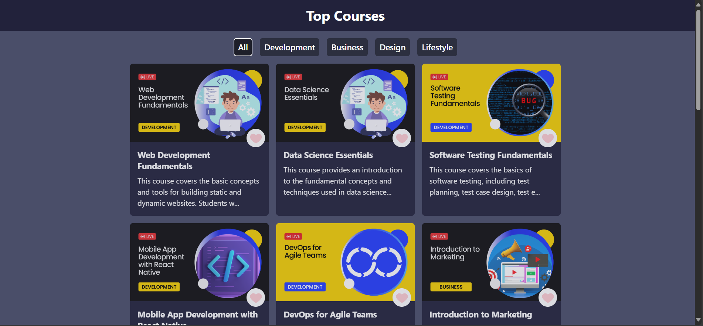
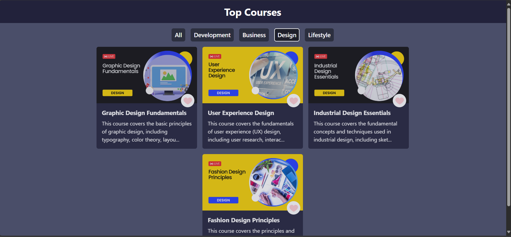
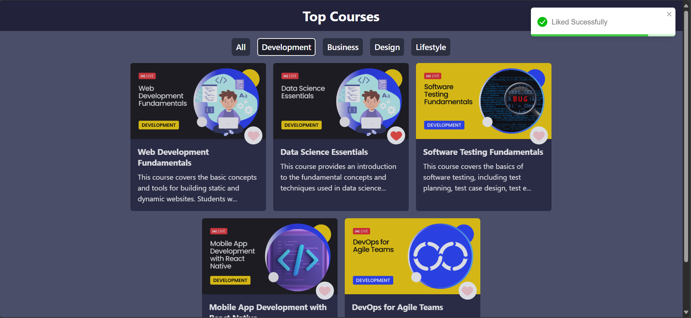

# Course Hub

Course Hub is a React-based platform that allows users to browse and filter courses dynamically. It fetches course data from an API and provides an interactive UI for easy course discovery.

## Features
- Fetches courses dynamically from an API
- Category-based filtering
- User-friendly UI with responsive design

## Technologies Used
- React.js
- Tailwind CSS
- API for course data

## Screenshot

